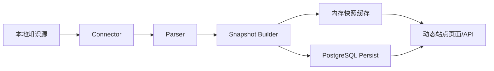
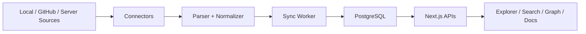

# 总体架构

## 目标

- 用动态站点替代纯静态构建，减少整站重建依赖
- 保留本地 Markdown 知识库工作流
- 为多知识源和分布式接入预留扩展点
- 让数据库成为中期主读模型，而不是只做离线备份

## 当前架构

## 读路径

当前采用双通道读路径：

1. 优先读 PostgreSQL
   适用于首页概览、搜索、单篇文档、Explorer 和图谱。
2. 数据库不可用或知识源未持久化时回退到内存快照
   保障开发态和初始化阶段可用。
3. Explorer 与图谱当前从 `documents` 表运行时投影生成
   还没有单独的图谱物化表。

## 写路径

1. Connector 扫描知识源
2. Parser 解析 Markdown、frontmatter、标签、链接和摘要
3. Snapshot Builder 生成统一 `KnowledgeSnapshot`
4. `persistSourceSnapshot` 将 `source / documents / sync_runs` 写入 PostgreSQL

## 模块边界

### `apps/web`

- Next.js 页面
- Route Handlers API
- 运行时配置
- 服务层聚合逻辑

### `packages/core`

- `KnowledgeSource`
- `ParsedKnowledgeDocument`
- `KnowledgeSnapshot`
- connector / parser / repository 契约

### `packages/connectors`

- 当前已实现 `localConnector`
- 后续扩展 `githubConnector`、`serverConnector`

### `packages/parser`

- 统一 Markdown 解析
- frontmatter 容错
- 摘要、标签、双链提取

### `packages/sync`

- 目录树构建
- 图谱构建
- 概览统计构建

### `packages/db`

- PostgreSQL schema 初始化
- 快照持久化
- 持久化概览、搜索、文档、Explorer、图谱查询
- 同步记录查询

## 当前限制

- Explorer 和图谱还没有独立物化读模型
- 还没有 watcher 驱动的自动同步
- 还没有 GitHub / server connector
- PostgreSQL 目前仍是“手动 persist 后可读”，不是持续增量同步

## 下一阶段架构目标

